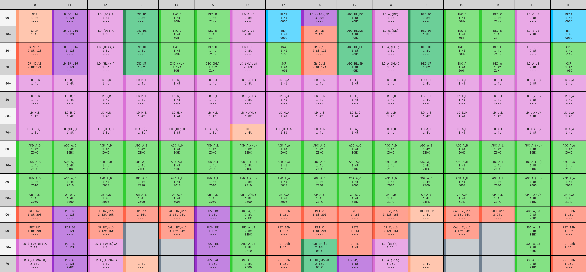
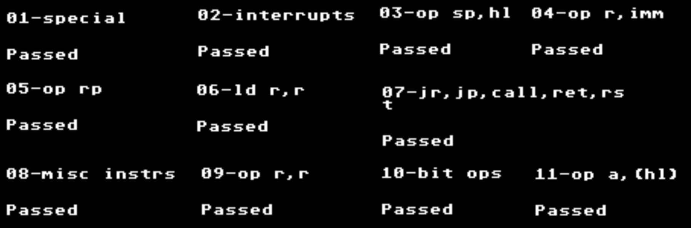
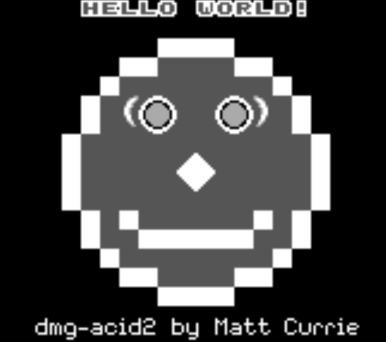
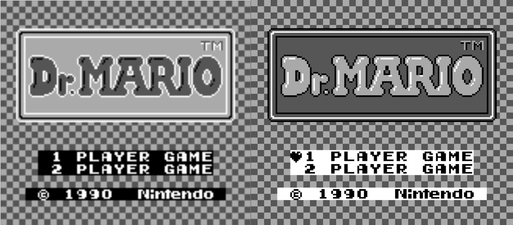
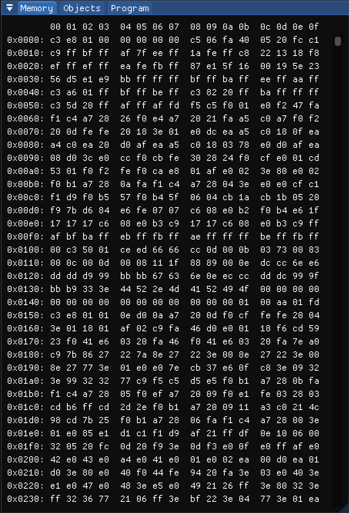
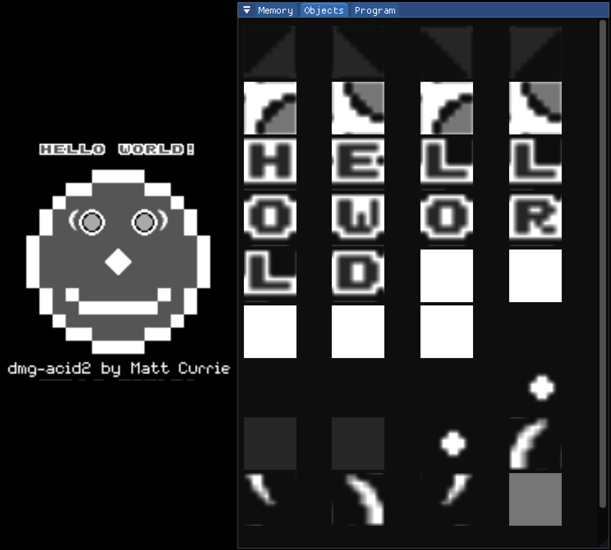
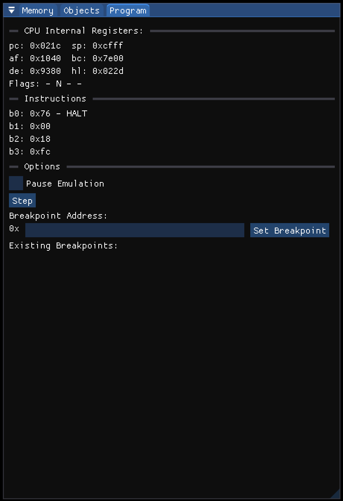

Playing emulated versions of my favorite games from my childhood has been a pastime of mine for a while now. Through the years I've re-played the originals with improved graphics, beaten modified versions of games that make them more challenging, and even played fully-featured original fan games.

As my understanding of the inner workings of computers expanded, the prospect of creating my _own_ emulator became more and more appealing. [This video especially](https://www.youtube.com/watch?v=hy2yY5a1Z-0) gave me an extra push towards this project, listing the numerous resources available for those interested in developing emulation of the Nintendo Game Boy system specifically.

I will showcase here the progress of this emulator, and plan to further detail some of the components at a later date, which will eventually be linked here.

# Selecting a Stack

The first step for this project was to pick the tech stack. From reviewing [some of the available documentation](https://gbdev.io/pandocs/) on the internal operation of the Game Boy, and from my own existing knowledge on how computers work in general, it seemed that low-level memory management and bitwise operations would be important tools. I knew that it would help for the programming language I chose to have strong capabilities with these, which narrowed it to the lower-level programming languages (e.g. C, C++, Rust, etc.)

_(As an aside, I used the term "lower level programming language" and referred to C/C++/Rust as such, but this isn't entirely accurate. Firstly, these languages aren't really on the same "low level", and second even "high level" languages like python have the ability to do low level memory management. This is something I encountered when viewing some of the implementations that others have done in other languages.)_

Ultimately, I selected C++ due to its extensive support for OpenGL, which allowed this project to familiarize me with one of the most widely used graphics APIs. As for OpenGL extensions, I chose GLEW and GLFW because of their widespread use and cross-platform capabilities.

# The Instruction Set

The original Game Boy CPU was a modified version of the Zilog Z80, an 8-bit microprocessor. The instruction set and opcodes are [publicly available](https://gbdev.io/pandocs/CPU_Instruction_Set.html), with several helpful resources like [interactive lookup tables](https://izik1.github.io/gbops/) and [algorithmic decoding guides](https://archive.gbdev.io/salvage/decoding_gbz80_opcodes/Decoding%20Gamboy%20Z80%20Opcodes.html).


_A Table of Game Boy Opcodes, Credit: https://izik1.github.io/gbops/_

I tested the individual implementation of each instruction with [Alex Tennant's "GameboyCPUTests"](https://github.com/adtennant/GameboyCPUTests), which are structured JSON tests.

```log
Start testing: Sep 25 09:36 NDT
----------------------------------------------------------
1/1 Testing: coretest_test
1/1 Test: coretest_test
Command: "/home/thomas/Projects/gameboy-emulator/build/tests/coretest"
Directory: /home/thomas/Projects/gameboy-emulator/build/tests
"coretest_test" start time: Sep 25 09:36 NDT
Output:
----------------------------------------------------------
===============================================================================
All tests passed (99200 assertions in 241 test cases)

<end of output>
Test time =   2.73 sec
----------------------------------------------------------
Test Passed.
"coretest_test" end time: Sep 25 09:36 NDT
"coretest_test" time elapsed: 00:00:02
----------------------------------------------------------

End testing: Sep 25 09:36 NDT
```

With the core CPU instructions working individually, the next requirement was to make sure they interact properly, as well as making sure that the machine state is correctly updated with operations like interrupts and instructions like `JP`, `CALL`, etc.

A widely accepted "test ROM" for this purpose is in [Blargg's test ROMs](https://github.com/retrio/gb-test-roms) (specifically the "cpu_instrs" ROMs). After some work, the emulator passed each of these individual test roms.


_A collection of passed test ROM outputs_

# LCD Emulation

The Game Boy's process for rendering pixels to its LCD screen is integral for proper emulation overall. This is not only because of the visual nature of the games, but because many programs rely on the interrupts triggered during rendering. The best example of this is the boot ROM, which scrolls the Nintendo logo downwards until it reaches the center of the screen, after which Emulation begins.


_Running the Game Boy Boot ROM_

In the equivalent program code, the horizontal line being rendered is constantly monitored until the last one is reached, at which point the logo is scrolled down by one pixel.

However, this sequence only tests a few parts of the overall graphics system. A better metric of a functioning system is the [dmg-acid2](https://github.com/mattcurrie/dmg-acid2) test. This test breaks a pixelated face in to several portions, which test the sprite, background, and window layers (described in detail in the [gbdev pandocs](https://gbdev.io/pandocs/Graphics.html)).


_A Successful and Happy dmg-acid2_

With a working CPU and graphics system, it should be possible for the emulator to run a full game! However, in reality there are still some bugs to be worked out... One of the main ones is the rendering of the object layer seemingly failing, as shown for instance with the "heart" cursor being invisible in the main menu of _Dr. Mario_.


_A Comparison of My Emulator (left) and an Established Emulator (right) running Dr. Mario_

# ImGUI Development Tools

At this point it became necessary to create more extensive debugging tools for finding the root causes when running ROMs. These debugging tools were created with [Dear ImGUI](https://github.com/ocornut/imgui), which enabled very fast development. These tools are shown below.


_A Simple Hexadecimal Live Memory Viewer_


_A Sprite Viewer for Objects in Memory_


_Debugging Controls and CPU Information Viewer_
